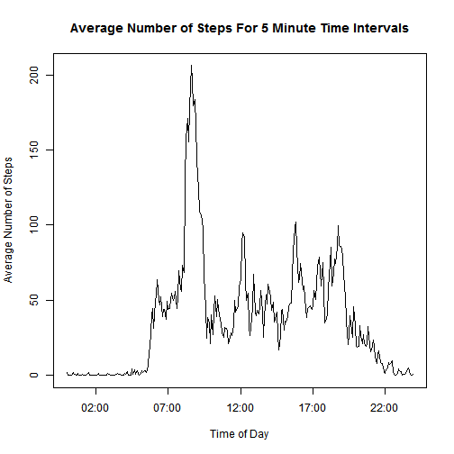
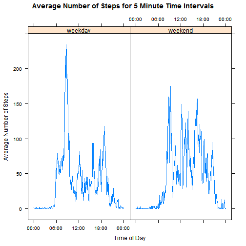

#Reproducible Research: Peer Assessment 1
Author: Jonathan D. Czerwonka

###Introduction
The purpose of this assignment is to do some exploratory analysis on personal movement data from activity monitoring devices.  This assignment assumes that the data is already in your working directory and that the lattice and lubridate libraries are already installed.  The source data used in this assignment can be found [here](https://d396qusza40orc.cloudfront.net/repdata%2Fdata%2Factivity.zip).

###Loading the Data
To load the data we will use the read.csv function.

```r
df <- read.csv("activity.csv",colClasses=c(as.numeric(),as.character(),as.numeric()))
```

For reasons I have been unable to identify, column 2 remains a factor variable, so we'll have to set its class to character once again.

```r
df$date <- as.character(df$date)
```


###Number of Steps Taken per Day
To get an understanding of the average number of steps taken per day, we'll first need to sum the steps by day which we can do with the aggregate function.

```r
sum_df = aggregate(steps~date,data=df,FUN=sum)
```
Then we can look at the distribution of the total number of steps taken per day by creating a histogram.

```r
hist(sum_df$steps, main="Histogram of Daily Step Totals", xlab="Daily Step Totals",breaks=10)
```

 
And we can determine the mean and median of the total number off steps taken per day with the following functions.

```r
mean(sum_df$steps)
```

```
## [1] 10766
```

```r
median(sum_df$steps)
```

```
## [1] 10765
```


###Daily Activity Pattern
To get an understanding of what an average day looks like, we can average the number of steps taken by interval by, again, using the aggregate function.

```r
avg_df = aggregate(steps~interval,data=df,FUN=mean)
```
Then we'll do some formatting to the interval column so that the accompanying plot will display the x-axis in a 24 hour time format.

```r
avg_df$interval = sprintf("%04d",avg_df$interval)
avg_df$interval = strptime(avg_df$interval, "%H%M")
plot(avg_df$interval,avg_df$steps,type="l",xlab="Time of Day",ylab="Average Number of Steps",main="Average Number of Steps For 5 Minute Time Intervals")
```

 


```r
time = strftime(avg_df[which(avg_df$steps == max(avg_df$steps,na.rm=TRUE)),1],format="%H:%M")
steps = avg_df[which(avg_df$steps == max(avg_df$steps,na.rm=TRUE)),2]
```
We can see that the peak number of steps taken for a given interval occurs at 08:35 with an average number of steps of 206.1698.


###Missing Values
Some of the days have missing values, coded as NAs, for some or all of their time intervals.  Some cursory exploratory analysis can show us how these missing values affect the data.

First the total number missing (TRUE) and non-missing (FALSE) time intervals are:

```r
table(is.na(df$steps))
```

```
## 
## FALSE  TRUE 
## 15264  2304
```

Next we'll create a new data frame where we replace the missing values with the average value for that time interval.


```r
missing_df = df
avg_df = aggregate(steps~interval,data=df,FUN=mean)

for(x in 1:nrow(missing_df)){
  if(is.na(missing_df[x,1])==TRUE){
    row = which(avg_df$interval == missing_df[x,3])
    missing_df[x,1] = avg_df[row,2]
  }
}
```

Then we'll reproduce our analysis in section "Number of Steps Taken per Day".


```r
sum_df = aggregate(steps~date,data=missing_df,FUN=sum)
hist(sum_df$steps, main="Histogram of Daily Step Totals", xlab="Daily Step Totals",breaks=10)
```

 

```r
mean(sum_df$steps)
```

```
## [1] 10766
```

```r
median(sum_df$steps)
```

```
## [1] 10766
```


###Differences in Activity Patterns
Because people often engage in different types of activities during the weekend as opposed to weekdays, it would make sense that we might find different activity patterns for these two time periods.  To investigate this we'll create a new data frame and add a  variable weekend with values TRUE for weekend and FALSE for weekday.  


```r
wk_df = df
wk_df$date = strptime(wk_df$date,"%Y-%m-%d")
library(lubridate)
wk_df$weekend = wday(wk_df$date)
wk_df$weekend = wk_df$weekend == 7 | wk_df$weekend == 1
```

Next we'll find the average number of steps taken in a 5 minute time interval for both values of weekend which we'll do with aggregate function.

```r
avg_wk_df = aggregate(steps~weekend+interval,data=wk_df,FUN=mean)
```

In order to produce tidy data we'll then rename the values of the weekend variable to 'weekend' and 'weekday'.


```r
for(x in 1:nrow(avg_wk_df)){
  if(avg_wk_df[x,1]==TRUE){
    avg_wk_df[x,1]="weekend"
  }else{
    avg_wk_df[x,1]="weekday"
  }
}
```

Finally we'll format and change the classes of our dataframe so that it can be easily graphed.


```r
avg_wk_df$interval = sprintf("%04d",avg_wk_df$interval)
avg_wk_df$interval = strptime(avg_wk_df$interval, "%H%M")
avg_wk_df$interval = as.POSIXct(avg_wk_df$interval)
avg_wk_df$weekend = as.factor(avg_wk_df$weekend)

library(lattice)
xyplot(steps~interval|weekend,data=avg_wk_df,type="l",main="Average Number of Steps for 5 Minute Time Intervals",xlab="Time of Day",ylab="Average Number of Steps", scales=list(x=list(format = "%H:%M")))
```

 
